# 🧪 Guia Passo a Passo: Criando seu Primeiro Projeto com Spring Initializr

Este guia vai te mostrar, passo a passo, como criar um projeto Spring Boot usando o **Spring Initializr**. Ideal para quem está começando agora no mundo da programação com Java e quer desenvolver aplicações modernas!

---

## ✅ Requisitos

Antes de começar, é importante ter instalado:

* Navegador de internet (Google Chrome, Firefox, Edge etc.)
* IDE como IntelliJ IDEA, Eclipse ou Visual Studio Code
* Java 21 instalado na máquina (pode ser instalado junto com a IDE)

---

## 🚀 Passo a Passo: Criando o Projeto

### 1. Acesse o Spring Initializr

Abra o navegador e acesse:
👉 [https://start.spring.io](https://start.spring.io)

### 2. Preencha as Informações do Projeto

No formulário da página:

* **Project**: `Maven`
* **Language**: `Java`
* **Spring Boot**: `3.5.4`
* **Project Metadata**:

  * **Group**: `br.com.casasbahia`
  * **Artifact**: `hello-springboot`
  * **Name**: `hello-springboot`
  * **Description**: `Projeto inicial com Spring Boot`
  * **Package name**: `br.com.casasbahia.hellospringboot`
* **Packaging**: `Jar`
* **Java**: `21`

    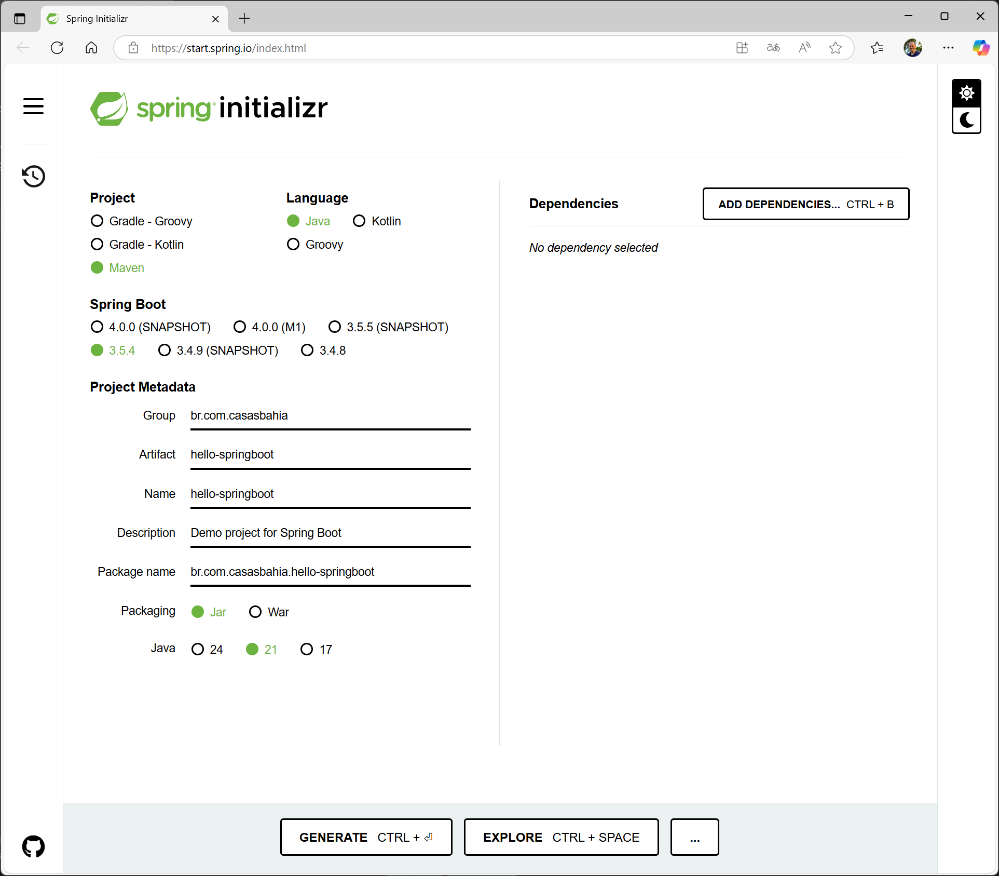


### 3. Adicione Dependências

Clique no botão **"Add Dependencies"** e adicione:

* ✅ `Spring Web`

    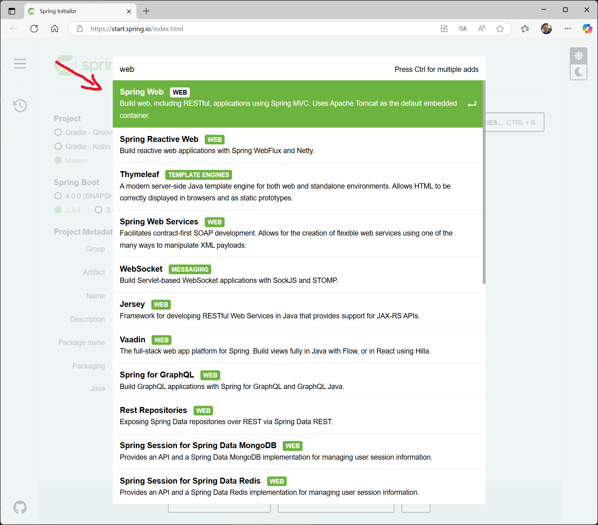

### 4. Gerar o Projeto

* Clique no botão **"Generate"**.

    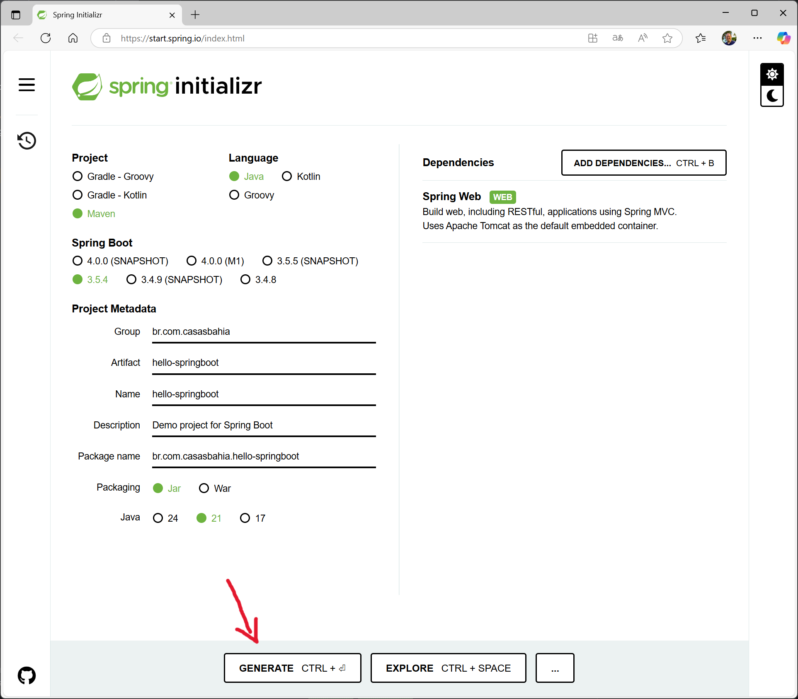


Um arquivo `.zip` será baixado automaticamente para seu computador.

### 5. Extraia o Projeto

* Vá até a pasta onde o arquivo `.zip` foi salvo
* Clique com o botão direito e selecione **"Extrair tudo"** ou use um descompactador como o WinRAR ou 7-Zip
* Sera gerada uma pasta chamada `hello-springboot` com a estrutura do projeto, incluindo os arquivos `pom.xml` e a estrutura de diretórios do Spring Boot.
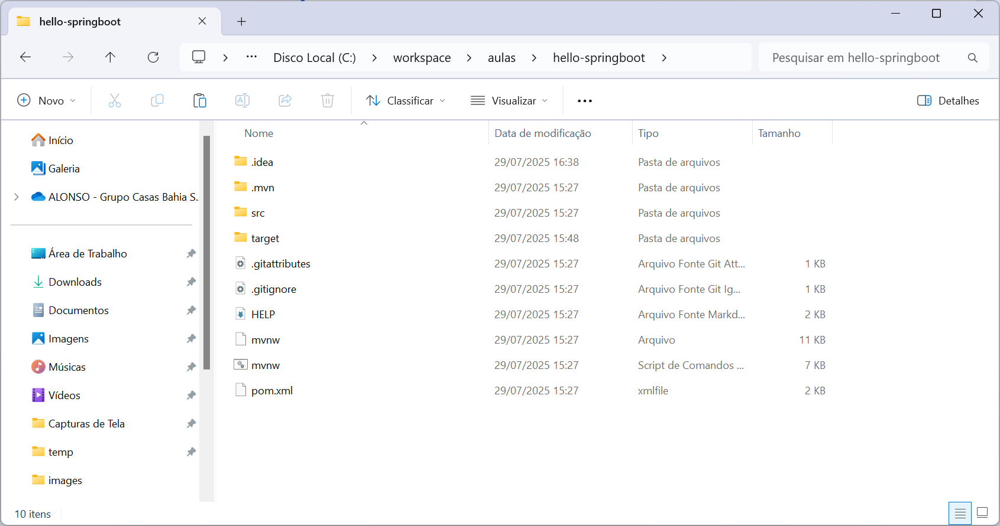

### 6. Abrir o Projeto na IDE


1. Abra o IntelliJ
2. Clique em **"Open"** ou **"Import Project"**
    
    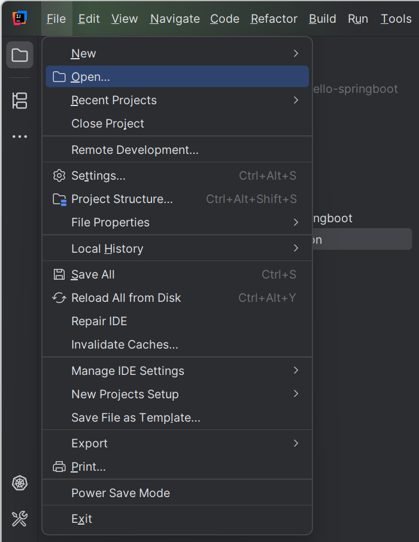

3. Navegue até a pasta extraída e selecione o projeto `hello-springboot`


4. Se aparecer uma mensagem de alerta sobre "Trust Project", clique em **"Trust Project"** para permitir que o IntelliJ carregue o projeto corretamente.

    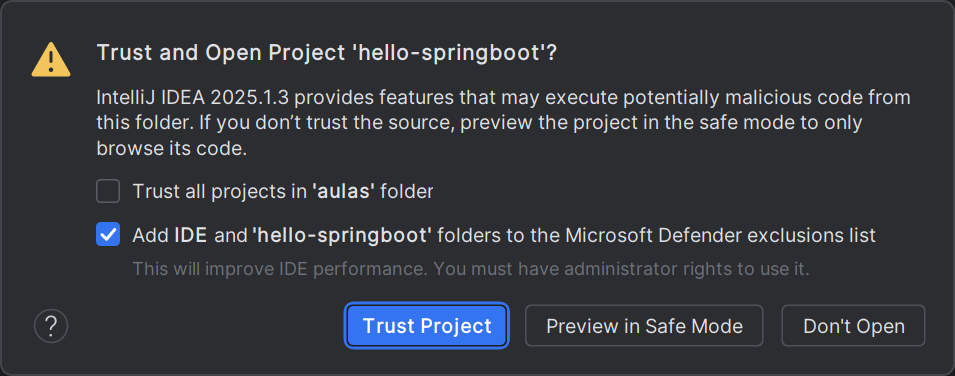


5. Aguarde o carregamento e a indexação do projeto

    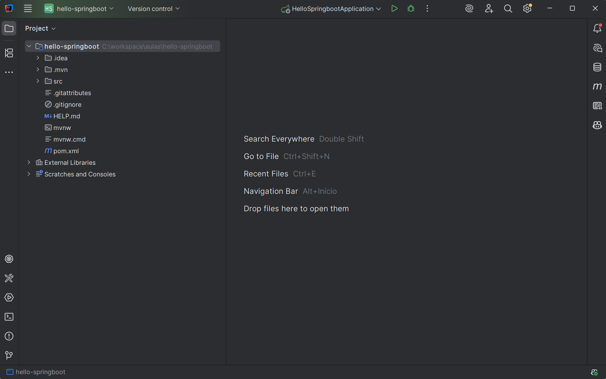


---


## 🚀 Criando os Endpoints

A seguir, vamos criar nosso primeiro endpoint em Spring Boot. Um *endpoint* é um ponto de acesso da aplicação que responde a requisições HTTP.

---

### 1. Explicação da classe principal

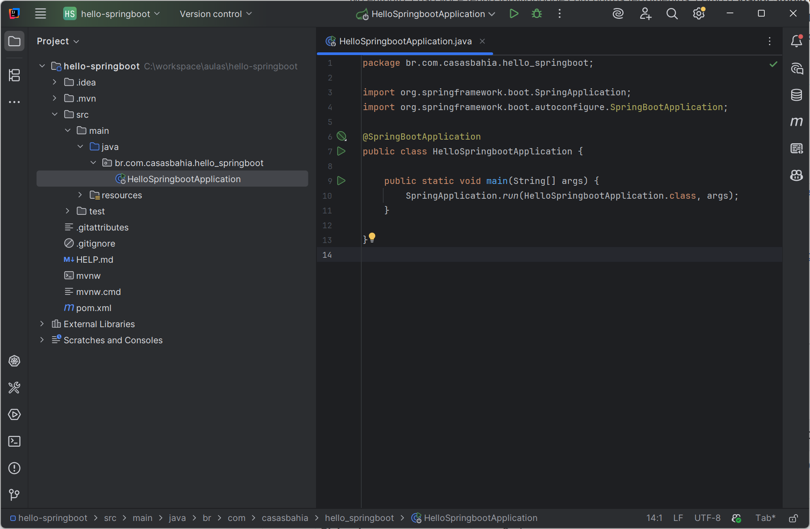

```java
package br.com.casasbahia.hello_springboot;

import org.springframework.boot.SpringApplication;
import org.springframework.boot.autoconfigure.SpringBootApplication;

@SpringBootApplication
public class HelloSpringbootApplication {
    public static void main(String[] args) {
        SpringApplication.run(HelloSpringbootApplication.class, args);
    }
}
```

* `@SpringBootApplication`

  * Marca esta classe como ponto de partida do Spring Boot.
  * Engloba três anotações: `@Configuration`, `@EnableAutoConfiguration` e `@ComponentScan`.
* `SpringApplication.run(...)`

  * Inicializa o contexto do Spring e inicia o servidor web embutido (Tomcat, por padrão).

---

### 2. O que é um endpoint?

Um **endpoint** é uma URL (rota) onde sua aplicação recebe requisições HTTP (GET, POST, PUT, DELETE etc.) e devolve respostas (JSON, texto, HTML etc.).

No Spring Boot, criamos endpoints usando controladores anotados com `@RestController` e mapeamentos como `@GetMapping`.

---

### 3. Exemplo de Controller

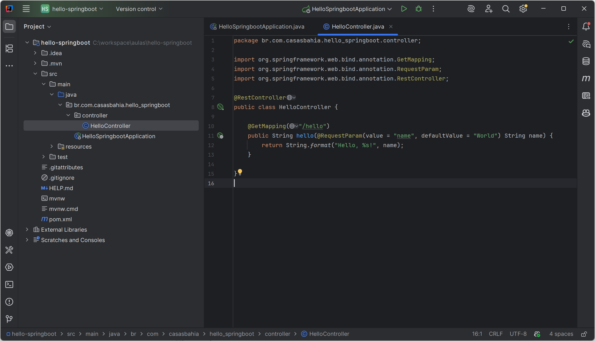

```java
package br.com.casasbahia.hello_springboot.controller;

import org.springframework.web.bind.annotation.GetMapping;
import org.springframework.web.bind.annotation.RequestParam;
import org.springframework.web.bind.annotation.RestController;

@RestController
public class HelloController {

    @GetMapping("/hello")
    public String hello(
        @RequestParam(value = "name", defaultValue = "World") String name
    ) {
        return String.format("Hello %s!", name);
    }
}
```

#### Principais anotações e imports

* `@RestController` (import: `org.springframework.web.bind.annotation.RestController`)

  * Indica que a classe trata requisições REST e retorna dados diretamente no corpo da resposta.
* `@GetMapping("/hello")` (import: `org.springframework.web.bind.annotation.GetMapping`)

  * Mapeia requisições HTTP GET para o método `public String hello(...)`.
* `@RequestParam` (import: `org.springframework.web.bind.annotation.RequestParam`)

  * Extrai parâmetros da query string da URL (ex.: `/hello?name=Maria`).

---

### 4. Passo a passo para criar as classes

1. **Criar o pacote controller**

   * No IntelliJ, clique com o botão direito em `src/main/java/br/com/casasbahia/hello_springboot`.

        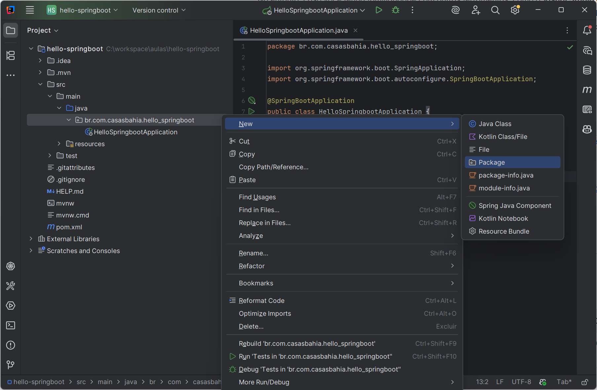

   * Selecione **New > Package** e nomeie como `controller`.

2. **Adicionar a classe HelloController**

   * Dentro de `src/main/java`, crie a pasta `controller` em `br/com/casasbahia/hello_springboot`.
   * Crie o arquivo `HelloController.java` neste pacote.

        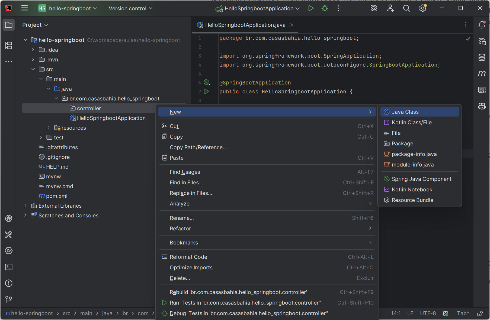

3. **Implementar o endpoint**

   * Cole ou digite o código do controller da Seção 3 `Exemplo de Controller`.
   * Quando estiver digitando, o IntelliJ pode sugerir automaticamente as anotações e imports necessários. Se isso acontecer, pressione `Enter` para aceitar a sugestão.

4. **Importar as classes necessárias**
    * No IntelliJ, se você ver erros de importação (classes sublinhadas em vermelho), posicione o cursor sobre a classe sublinhada e pressione `Alt + Enter`.
   * Selecione a opção para importar a classe necessária.
   * Você também pode usar o atalho `Ctrl + Alt + O` para otimizar os imports automaticamente.

5. **Entendendo o fluxo**

   * O Spring encontra a anotação `@RestController` e indica que a classe trata requisições REST e retorna dados diretamente no corpo da resposta.
   * Com a anotação `@GetMapping`, o Spring registra o mapeamento do endpoint `/hello` e, quando acionado por uma requisição, direciona a requisição para a função correspondente, no caso a `hello(...)`.

---

Pronto! Agora você já tem um endpoint básico, `/hello`, rodando em Spring Boot.

## 🧪 Executando a Aplicação

1. Localize a classe `HelloSpringbootApplication.java` no caminho:

    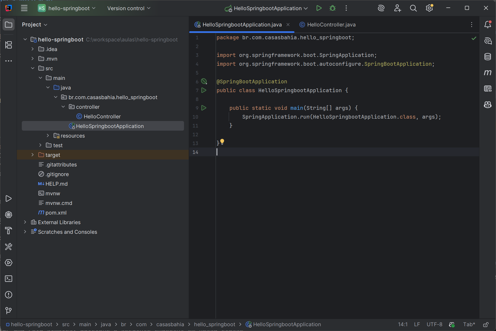

2. Clique com o botão direito sobre a classe e escolha **"Run"** (ou use o botão ▶️ da IDE)

3. A aplicação irá iniciar e mostrar algo como:

   ```
   Tomcat started on port(s): 8080
   ```


### 📚 Entendendo o Código
O endpoint `/hello` recebe um parâmetro opcional `name`. Se não for fornecido, o valor padrão será "World". O método retorna uma mensagem formatada com o nome fornecido.
Se tudo estiver correto, você verá a mensagem "Hello World!" ou "Hello SeuNome!" dependendo do parâmetro passado.

### Testando o Endpoint
* Abra o navegador e acesse:
    ```
    http://localhost:8080/hello
    ```
* Para testar com um nome específico, acesse:
    ```
    http://localhost:8080/hello?name=SeuNome
    ``` 

---


## 📌 Dicas

* Se quiser criar uma rota simples, adicione o seguinte endpoint em nossa classe `HelloController`:

    ```java
        @GetMapping("/ping")
        public String ping() {
            return "pong";
        }
    ```

* Salve, rode o projeto novamente, e acesse:
        
    ```
    http://localhost:8080/ping
    ```
    Se tudo estiver ok, aparece a mensagem "pong" como resposta.

---


## Repositório do Projeto
Você pode acessar o repositório do projeto no GitHub para ver o código completo e acompanhar as atualizações:

👉 [Repositório do Projeto Hello Spring Boot](https://github.com/alonsodecarli-via/hello-springboot)

---

🎉 **Parabéns!**

Você criou com sucesso seu primeiro projeto com Spring Boot usando o Spring Initializr! 👏

Ao longo das aulas vamos continuar explorando e aprendendo novos recursos do Spring!
